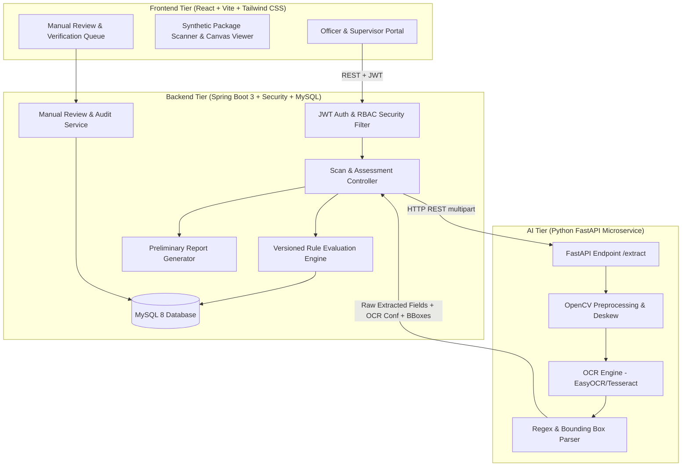
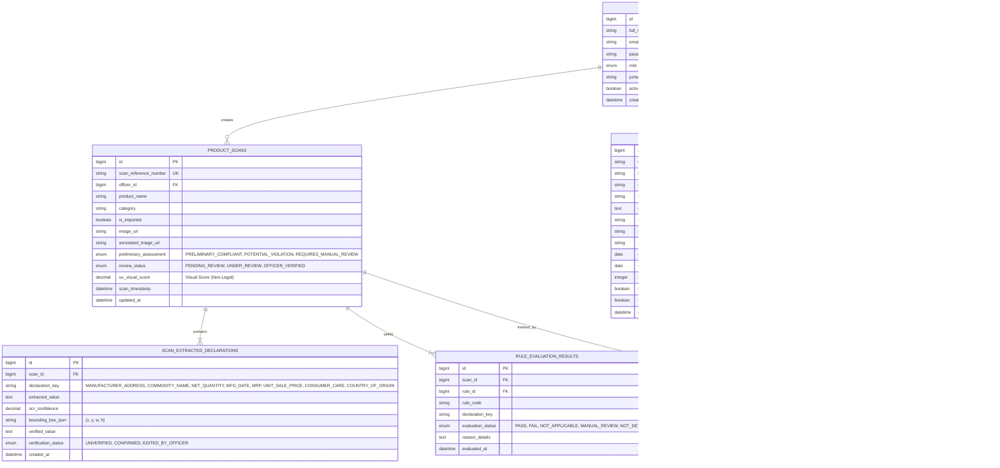
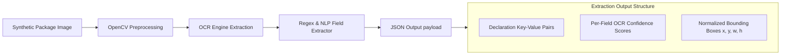
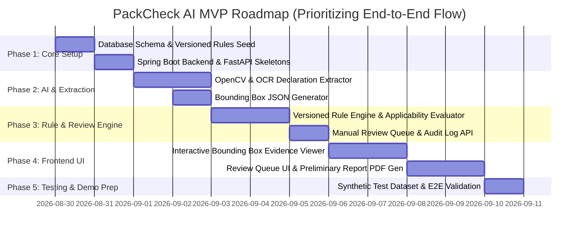

# Revised Architecture & Implementation Plan: PackCheck AI
**SIH 2026 Problem Statement:** SIH26034 — Software System to check compliance of Packaged Commodities under Legal Metrology (Packaged Commodities) Rules, 2011 by scanning products, images and labels.

> [!IMPORTANT]
> **System Positioning & Legal Scope**
> PackCheck AI is strictly designed as an **AI-assisted preliminary compliance assessment system**. It provides decision-support tools for Enforcement Officers and Supervisors. It **does not** issue legally binding certifications or penalty orders. All findings remain preliminary until verified by an authorized enforcement officer through the integrated Manual Review Queue.

---

## A. Complete System Architecture

### A.1 Three-Tier Architecture Model
The solution uses a lightweight, decoupled 3-tier architecture optimized for local MVP deployment:
- **Presentation Tier (Frontend):** React 18 + Vite + Tailwind CSS + Lucide Icons + Canvas Bounding-Box Evidence Viewer.
- **Application & Domain Tier (Backend):** Java 17 + Spring Boot 3 + Spring Security (JWT) + Spring Data JPA + MySQL 8 + PDF Report Generator.
- **Vision & Extraction Tier (AI Microservice):** Python 3.10 + FastAPI + OpenCV + EasyOCR / Tesseract + Regex NLP Extractor.

### A.2 Decoupled Three-Layer Decision Flow
The system strictly separates processing into 3 isolated layers:
1. **OCR & Extraction Layer**: Extracts raw text, calculates OCR confidence scores ($0.0 - 1.0$), and returns normalized bounding box coordinates.
2. **Rule Evaluation Layer**: Applies versioned Legal Metrology rule logic (accounting for rule applicability conditions) and outputs explicit statuses (`PASS`, `FAIL`, `NOT_APPLICABLE`, `MANUAL_REVIEW`, `NOT_DETECTED`).
3. **Human Verification Layer**: Officer reviews extracted evidence in the Manual Review Queue, confirms/dismisses flagged items, edits values if needed, and approves the Preliminary Assessment.

---

## B. Revised Database Schema

---

## C. Revised REST API Specification

### C.1 Authentication & User Management
- `POST /api/v1/auth/login`: Authenticate and obtain JWT token + role info.
- `GET /api/v1/users/me`: Return authenticated user details.

### C.2 Scanning & Preliminary Assessment Pipeline
- `POST /api/v1/scans/analyze`: Upload synthetic/scanned image + metadata (`product_name`, `category`, `is_imported`). Triggers OCR microservice -> executes Rule Engine -> stores preliminary scan result.
- `GET /api/v1/scans`: Filterable inspection history (search, date range, preliminary assessment status, officer).
- `GET /api/v1/scans/{id}`: Detailed assessment view returning scan metadata, raw extracted declarations with OCR confidence scores, bounding boxes, versioned rule evaluation outcomes, and manual review logs.

### C.3 Officer Manual Review Queue & Verification
- `GET /api/v1/review-queue`: Fetch scans awaiting manual review (`PENDING_REVIEW` or `REQUIRES_MANUAL_REVIEW`).
- `PUT /api/v1/scans/{id}/declarations`: Update/verify an extracted declaration (`verified_value`, status `CONFIRMED` or `EDITED_BY_OFFICER`).
- `POST /api/v1/scans/{id}/review-action`: Submit officer review decision (`CONFIRM_VIOLATION`, `DISMISS_VIOLATION`, `APPROVE_PRELIMINARY_ASSESSMENT`) with mandatory officer notes.

### C.4 Preliminary Reporting
- `GET /api/v1/scans/{id}/report/pdf`: Download the official **"Preliminary Compliance Assessment Report"** PDF containing product snapshot, bounding box evidence, rule outcome breakdown, source rule versions, and officer verification signature block.

### C.5 Rule Engine Configuration (Admin)
- `GET /api/v1/rules`: List versioned Legal Metrology rules with source document/version metadata.
- `POST /api/v1/rules`: Create a new version of a rule with updated `effective_from`, `source_version`, and `applicability_condition`.
- `PUT /api/v1/rules/{id}`: Toggle active status or update rule parameters.

---

## D. Configurable & Versioned Rule Engine Design

### D.1 Source Document & Versioning Metadata
Every rule in the database is linked to official Department of Consumer Affairs sources:
- **Source Document:** *Legal Metrology (Packaged Commodities) Rules, 2011 (as amended through 2026)*
- **Source Version:** E.g., `v2026.1`
- **Fields:** `rule_code`, `legal_reference`, `source_document`, `source_version`, `effective_from`, `effective_to`, `applicability_condition`, `active`.

### D.2 Rule Applicability & Conditional Evaluation Matrix

| Rule Code | Legal Ref | Applicable Condition | Criteria for Outcomes |
| :--- | :--- | :--- | :--- |
| `LM_RULE_01` | Rule 6(1)(a) | `ALWAYS` | **PASS**: Manufacturer/Packer name & address detected. **NOT_DETECTED**: Missing address. **MANUAL_REVIEW**: OCR confidence < 0.65. |
| `LM_RULE_02` | Rule 6(1)(b) | `ALWAYS` | **PASS**: Generic commodity name detected. **NOT_DETECTED**: Missing name. |
| `LM_RULE_03` | Rule 6(1)(c) | `ALWAYS` | **PASS**: Net quantity with metric unit (`g`, `kg`, `ml`, `l`, `N`). **FAIL**: Non-standard unit. **NOT_DETECTED**: Missing. |
| `LM_RULE_04` | Rule 6(1)(d) | `ALWAYS` | **PASS**: Valid Month & Year of Mfg/Packing (`MM/YYYY`). **FAIL**: Invalid date format. **NOT_DETECTED**: Missing. |
| `LM_RULE_05` | Rule 6(1)(e) | `ALWAYS` | **PASS**: MRP formatted with "inclusive of all taxes". **FAIL**: MRP present without tax phrase. **NOT_DETECTED**: Missing MRP. |
| `LM_RULE_06` | Rule 6(1)(f) | `ALWAYS` | **PASS**: Consumer care email/phone/address present. **NOT_DETECTED**: Missing helpline. |
| `LM_RULE_07` | Rule 6(1)(g) | `is_imported == true` | **PASS**: Country of origin specified. **FAIL**: Imported package missing country of origin. **NOT_APPLICABLE**: Domestic package (`is_imported == false`). |
| `LM_RULE_08` | USP Rule | `net_qty > 1g/1ml` | **PASS**: Unit sale price present. **NOT_APPLICABLE**: Package contents $\le$ 1g/1ml. |

### D.3 Rule Evaluation Statuses & Overall Assessment Mapping
The evaluation produces explicit per-rule statuses:
- **`PASS`**: Declaration present and satisfies Legal Metrology rule criteria.
- **`FAIL`**: Declaration present but violates format or statutory requirement.
- **`NOT_DETECTED`**: Mandatory declaration missing from OCR scan.
- **`NOT_APPLICABLE`**: Rule not applicable based on commodity category or import status.
- **`MANUAL_REVIEW`**: Extraction fuzzy or OCR confidence below reliability threshold (< 65%).

#### Overall Preliminary Assessment Logic:
- If **any** mandatory rule evaluates to `FAIL` $\rightarrow$ **`POTENTIAL_VIOLATION`**
- If **any** mandatory rule evaluates to `MANUAL_REVIEW` or `NOT_DETECTED` (and zero `FAIL`) $\rightarrow$ **`REQUIRES_MANUAL_REVIEW`**
- If **all** applicable mandatory rules evaluate to `PASS` $\rightarrow$ **`PRELIMINARY_COMPLIANT`**

> [!NOTE]
> **Separate UX Health Score (Non-Legal):** An optional 0–100 visual metric is calculated strictly for UI dashboard visual progress bars. The application UI explicitly labels this: *"Visual Extraction Completeness (Non-Legal Indicator)"*.

---

## E. AI / OCR Pipeline

1. **Preprocessing (OpenCV):** Image rotation correction, contrast normalization, adaptive thresholding to maximize label legibility.
2. **Text & Box Detection (Tesseract / EasyOCR):** Extracts text blocks with bounding polygon ratios $[x, y, w, h]$ and confidence values ($0.0 - 1.0$).
3. **Pattern Parser (Regex NLP):**
   - **MRP:** Matches `(MRP|Maximum Retail Price)\s*(Rs\.?|₹)?\s*(\d+(\.\d{2})?)\s*(incl\.?\s*of\s*all\s*taxes)?`
   - **Net Qty:** Matches `(Net\s*Qty|Net\s*Quantity|Net\s*Wt)\s*:?\s*(\d+(\.\d+)?)\s*(g|kg|ml|l|L|N|pcs)`
   - **Mfg Date:** Matches `(Mfg|Pkd|Packed|Date\s*of\s*Mfg)\s*:?\s*(\d{2}[/-]\d{4}|\w{3}\s*\d{4})`
   - **Consumer Care:** Matches `(Customer\s*Care|Helpline|Email|Phone)\s*:?\s*([\w\.-]+@[\w\.-]+|\+?\d{10,12})`

---

## F. Complete MVP Feature List

1. **Authentication & RBAC**: Secure login for Enforcement Officers, Supervisors, and System Administrators.
2. **Synthetic Image Scanner**: Fast package label upload with sample synthetic packaging dataset.
3. **Interactive Bounding Box Evidence Viewer**: Click any extracted declaration or rule to instantly highlight the exact label region on the image.
4. **OCR & Confidence Scoring**: Display raw extracted values alongside field-level OCR confidence meters.
5. **Versioned Legal Metrology Rule Evaluator**: Automated evaluation of rules with conditional applicability (`is_imported`, `net_quantity`).
6. **5-State Outcome Breakdown**: Visual badges for `PASS`, `FAIL`, `NOT_APPLICABLE`, `MANUAL_REVIEW`, `NOT_DETECTED`.
7. **Officer Manual Review Queue**: Dedicated workflow interface to inspect flagged scans, edit extracted fields, confirm/dismiss violations, and log audit notes.
8. **Preliminary Compliance Assessment Report**: PDF report generator outputting official legal-style preliminary inspection summary with evidence images.
9. **Dashboard & History**: Searchable audit logs with date filters, category filters, and status distribution metrics.
10. **Rule Management UI**: Admin panel to review active versioned rules, legal references, and source amendment dates.

---

## G. Streamlined MVP Development Roadmap

---

## H. Testing & Synthetic Dataset Strategy

### H.1 Synthetic Package Test Dataset
To ensure complete safety and avoid using altered real commercial brand images during development and judging demos, we will generate **5 synthetic package label graphic samples**:

1. **Synthetic Sample A (`SYN_COMPLIANT_01`)**: Domestic packaged snack item with 100% complete declarations (MRP with tax clause, Net Qty in grams, Mfg Date, Address, Consumer Care).
   - Expected Result: `PRELIMINARY_COMPLIANT` (`PASS` on all rules).
2. **Synthetic Sample B (`SYN_IMPORTED_FAIL_01`)**: Imported cosmetics label marked `Imported By XYZ Pvt Ltd` but **missing Country of Origin**.
   - Expected Result: `POTENTIAL_VIOLATION` (`FAIL` on `LM_RULE_07`).
3. **Synthetic Sample C (`SYN_MRP_TAX_FAIL`)**: Grocery packet listing `MRP Rs. 150.00` but **omitting "inclusive of all taxes"**.
   - Expected Result: `POTENTIAL_VIOLATION` (`FAIL` on `LM_RULE_05`).
4. **Synthetic Sample D (`SYN_FUZZY_REVIEW`)**: Packet with partially smudged Mfg date causing low OCR confidence ($0.45$).
   - Expected Result: `REQUIRES_MANUAL_REVIEW` (`MANUAL_REVIEW` on `LM_RULE_04`). Sent to Officer Review Queue.
5. **Synthetic Sample E (`SYN_DOMESTIC_NO_IMPORT`)**: Standard domestic spice packet (`is_imported = false`).
   - Expected Result: `LM_RULE_07` evaluates to `NOT_APPLICABLE`.

### H.2 Automated Integration & Verification Plan
- **Rule Engine Unit Tests**: Spring Boot JUnit test suite executing mock extraction JSON objects against the 5-state rule evaluation matrix.
- **End-to-End Workflow Test**: Automated REST test simulating: Image Upload $\rightarrow$ OCR Extraction $\rightarrow$ Rule Evaluation $\rightarrow$ Review Queue Assignment $\rightarrow$ Officer Verification $\rightarrow$ PDF Report Generation.

---

## User Review Required

> [!IMPORTANT]
> **Revised Architecture Ready for Review**
> All 15 specific requirements have been incorporated into this revised plan. No implementation code has been written yet.
>
> Please review this updated document and let us know if you approve proceeding to Phase 1 implementation!
